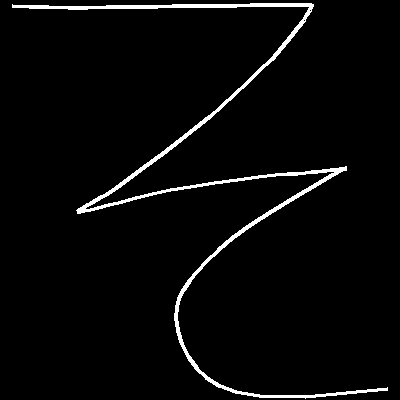

# Recognizing Japanese Text

## Project Goal:
Building an effective open sourced japanese digital writing classification model from the ground up.

## The Use Case:
Learning a new language is hard. Japanese presents an especially significant barrier with having over 2000 glyphs that need to be understood in order to achieve full literacy.
* Immersion is a very effective form of reinforcement and today there are a vast amount of tools that assist in this process.
* Doing drills of writing out the character (and it's radicals) helps the mind distinguish differences in recognizing certain characters that closely resemble one another.

Instead of separating the two the entire time, it could be far more efficient to leverage our digital devices with a high accuracy writing recognizer that leverages deep learning. Writing recognition for Japanese text exists more or less already, however the options available have a trend of being closed source and bloated with ads.

## The Plan:

Leverage what existing datasets are available that could be applied for immediate baseline evaluation/transfer learning. Begin collecting data with a stripped down app, but transition it into a full fledged learning tool that leverages Tensorflow Lite and provides an opt in for users to submit their writing data to build/improve the models.

## The Data:
* Hundreds of thousands of classified classical Japanese glyphs from the [Kuzushiji-49 dataset](https://github.com/rois-codh/kmnist/tree/12d650ef8a97d4e051d7650644912f9500067df6).
* Independent capture of digital writing leveraged from a simple [mobile phone app](https://github.com/coreyryanhanson/choubenkyo_kivy_app).

</img>

## The Notebooks
* [General training with the Kuzushiji Hiragana Dataset](initial_findings/kuzushiji_notebook.ipynb)
* [Building a base for transfer learning](initial_findings/kanji_transfer.ipynb)
* [Applying the models to original data](initial_findings/modeling_with_new_data.ipynb)

## The Roadmap:
### A general loose order of things to come:
**Stage 1** - Build an OCR recognition baseline using existing data from the Kuzushiji-49. The observations have a degree of separation from the goal of this project, but it also provides an advantages in terms of baseline/future generalizations in that it's classification is a more difficult task since the historical kuzushiji script is less standardized. **Started-5/13/2020**

**Stage 2** - Use transfer learning to bring the smaller dataset up to speed with the models of the Kuzushiji-49. This may additional tweaks or simplifications since the dataset does not account for [Dakuten and handakuten](https://en.wikipedia.org/wiki/Dakuten_and_handakuten) annotated characters and compound syllables.

**Stage 3** -Once there are significant observations build a standalone without the kuzushiji data and determine the best architecture for the OCR model.

**Stage 4** -  Explore the notion of using the raw data to provide additional data captured (the bitmap images inherently do nat capture stroke direction or order). There is reason to suspect that in addition to accuracy improvements the smaller filesize/reduced conversions could increase performance as well.

**Stage 5** Expand to the katakana and Kanji datasets.

## Evaluation criteria:

I chose to evaluate leveraging scikit-learn's balanced accuracy module. That allows each category to have an equal voice in determining the overall accuracy of the model despite the heavy class imbalance.

One caveat about using this metric is that balanced accuracy is meaningless in small batches where the full representation of characters is unknown so simple categorical accuracy was used for backpropogation and the validation splits.

The models were compared against a baseline predictor that made predictions in a random fashion weighted towards the representation of classes in the training set. The result:
* Accuracy: 0.0237
* Balanced Accuracy: 0.0208

## Model Performance
Updating in progress. See notebooks for up to date information.
All of the models vastly outperformed the baseline predictor:
* Simple 2 hidden layer dense network:
    * Accuracy: 0.761
    * Balanced Accuracy: 0.761
* Simple 3 hidden layer CNN:
    * Accuracy: 0.938
    * Balanced Accuracy: 0.929
* [VGG16 trained on imageNet](https://www.tensorflow.org/api_docs/python/tf/keras/applications/VGG16) transfer learning model:
    * Accuracy: 0.959
    * Balanced Accuracy: 0.956

However while these numbers are high for complicated dataset, there were some shortcomings when taking a closer look at the predictions that are better explained in the project notebook.

## Next Steps:
Updating in progress. See notebooks for up to date information.
The current best performing model appears to be in the position to benefit from reduction in complexity. The ideal optimizations would both reduce processing time and give a slight improvement to accuracy.

Without finding another OCR model, supplementing the kuzushiji-49 with their kanji dataset has potential enhance the earlier CNN weights through generalization, but it should be noted that the images that make up those observations are roughly double the resolution of the hiragana set. At this point, it also makes sense to drop the 3 obsoleted kana at least in the short term since they don't add much to the aforementioned use case.

This better performing model than can be applied/trained/tested against the independently collected observations.
