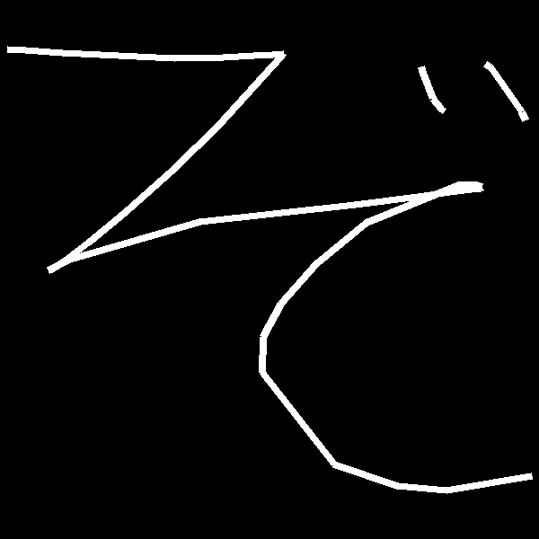
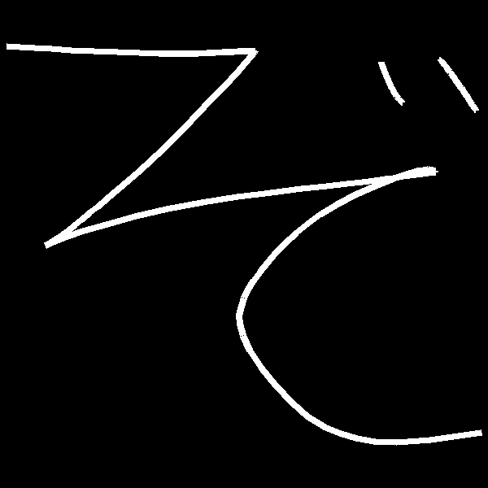
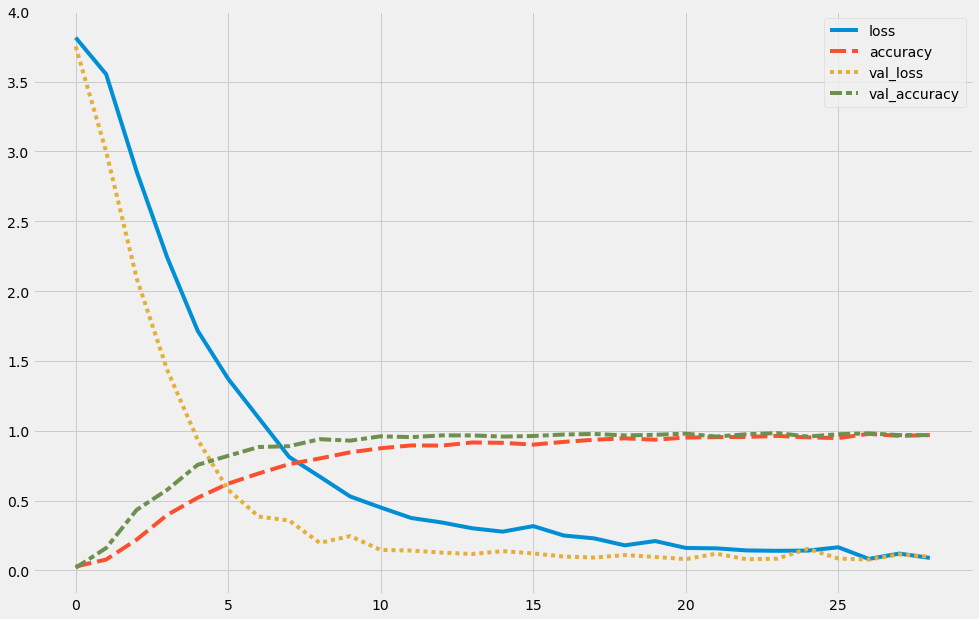
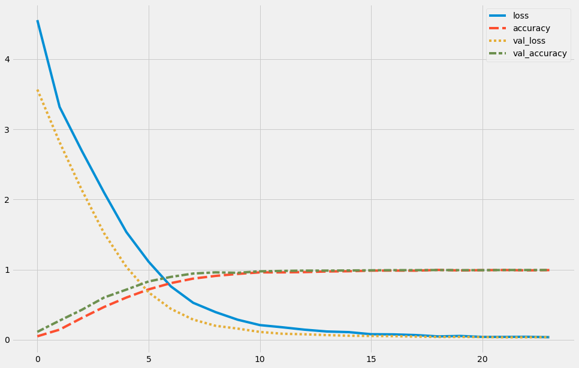
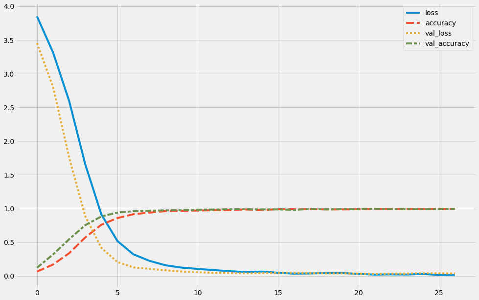
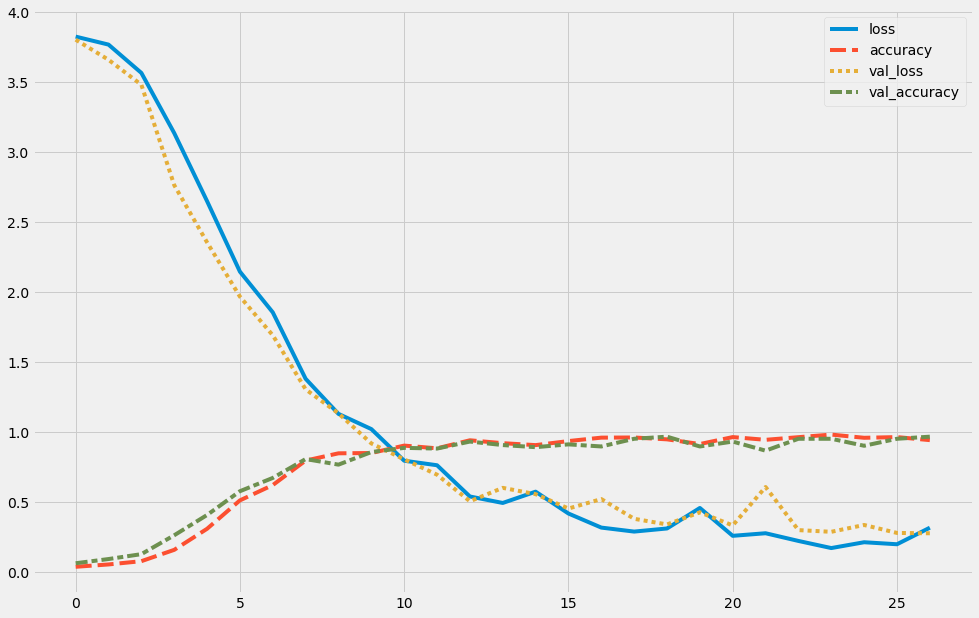

## Imports


```python
#Library imports
import re
import os
import sys
import shutil
import time
import math
import fnmatch
import random
import warnings
import numpy as np
import pandas as pd
import seaborn as sns
import matplotlib.pyplot as plt
#import matplotlib.font_manager as fm

from IPython.display import Image, display
from sklearn.dummy import DummyClassifier
from sklearn.model_selection import train_test_split
from sklearn.utils import class_weight
from PIL import Image, ImageDraw, ImageOps

from tensorflow.keras import models, Input
from tensorflow.keras.preprocessing.image import ImageDataGenerator, array_to_img, img_to_array, load_img
from tensorflow.keras.utils import to_categorical
from tensorflow.keras.models import Sequential
from tensorflow.keras import initializers
from tensorflow.keras.optimizers import Adam
from tensorflow.keras.layers import Dense, LSTM, Dropout, Conv2D, MaxPooling2D, Flatten
from tensorflow.keras.callbacks import EarlyStopping, ModelCheckpoint
from tensorflow.keras.regularizers import l1, l2

# Allows access to scripts and modules relative to the parent directory.
parent = os.path.dirname(os.getcwd())
sys.path.append(os.path.join(parent, "functions"))

#User Created functions

from cleaning_functions import *
from eda_functions import *
from modeling_functions import *
from setup_functions import *

from random_lumberjacks.src.random_lumberjacks.model.model_classes import *
from random_lumberjacks.src.random_lumberjacks.visualization.visualization_functions import *

#Notebook arguments
%matplotlib inline
```


```python
#Without this block the Japanese font's won't display properly in Matplotlib.Set to your font directory.
extend_matplotlib_fonts("/usr/share/fonts/")
```

    /home/anacuda/work/nyc-mhtn-ds-021720/japanese_text_classifiers/setup_functions.py:23: MatplotlibDeprecationWarning: 
    The createFontList function was deprecated in Matplotlib 3.2 and will be removed two minor releases later. Use FontManager.addfont instead.
      font_list = fm.createFontList(font_files)


```python
#Device specific gpu deterministic arguments
from tensorflow import config as tfconfig
physical_devices = tfconfig.list_physical_devices('GPU')
tfconfig.experimental.set_memory_growth(physical_devices[0], enable=True)
os.environ['TF_DETERMINISTIC_OPS'] = '1'
```


```python
#Sets random seeds to allow for reproducable results.
from tensorflow import random as tfrandom
SEED=127
os.environ['PYTHONHASHSEED']=str(SEED)
random.seed(SEED)
np.random.seed(SEED)
tfrandom.set_seed(SEED)
```

Since there are many classes, I've imported a json that contains useful information about the characters and stored it into a DataFrame.


```python
hiragana_classes = pd.read_json("../choubenkyo_kivy_app/app/draw_screen/characters/hiragana.json")

# By converting the recorded stroke count to a list of integers, it will be easier to iterate through the data and remove obvious mistakes from the start.
hiragana_classes["stroke_count"] = hiragana_classes["stroke_count"].map(lambda x: [int(item[0]) for item in re.finditer("\d+", x)])

# It will be useful to have seperate dataframes to account for dropped classes whether they are the obsolete kana or the compound characters.
current_hiragana_classes = hiragana_classes[(hiragana_classes["char_id"]!= "wi") & (hiragana_classes["char_id"]!= "we")].reset_index(drop=True)
reduced_hiragana_classes = current_hiragana_classes.iloc[0:46]
compound_hiragana_classes = current_hiragana_classes.iloc[46:]
```

## EDA and Data Conversion for the App Generated Observations

The data generated through the app is stored in the form of x and y coordinates from user interaction with the canvas in the order that they were pressed. The x and y coordinates are stored with in an array but each stroke (created each time the user lifts their finger from the screen) is stored within a larger dictionary seperated by integer keys that reference the order of creation. The following example is a recording of a capture for the hiragana character ぞ (zo) which was not included in the kuzushiji dataset, but it's base form そ (so) was.

The values can range from a -1 to 1 across an input area that is consistently a perfect square. Storing it this way is both lightweight and preserves more information regarding stroke order and direction than a bitmap would provide.


```python
example = load_pickle("../data/choubenkyo_data/example.pickle")
example
```


    {1: array([[-0.63829786,  0.54441524],
            [-0.59969783,  0.54115534],
            [-0.52203854,  0.53634429],
            [-0.28445774,  0.52590561],
            [-0.18277665,  0.52704024],
            [-0.11830277,  0.53096032],
            [-0.07959127,  0.53289294],
            [-0.05653203,  0.534132  ],
            [-0.06179174,  0.52601171],
            [-0.19258281,  0.38362145],
            [-0.28640158,  0.2893858 ],
            [-0.38861911,  0.19933558],
            [-0.46727445,  0.13545966],
            [-0.51671651,  0.09681916],
            [-0.54672268,  0.07867789],
            [-0.54990232,  0.07755327],
            [-0.50747295,  0.10083437],
            [-0.23254772,  0.1803453 ],
            [ 0.09554889,  0.21719646],
            [ 0.23005591,  0.23266578],
            [ 0.29517465,  0.24193215],
            [ 0.35456353,  0.25031304],
            [ 0.36077711,  0.25031304],
            [ 0.36175251,  0.2513938 ],
            [ 0.35126064,  0.25526381],
            [ 0.31375249,  0.25627375],
            [ 0.1178258 ,  0.17634535],
            [ 0.01229286,  0.09003234],
            [-0.06159948,  0.00566602],
            [-0.09971903, -0.06441617],
            [-0.10062052, -0.13813257],
            [ 0.05016579, -0.3305881 ],
            [ 0.18437094, -0.37684441],
            [ 0.28934664, -0.38636184],
            [ 0.46767394, -0.35640216]]),
     2: array([[0.23332304, 0.50533867],
            [0.23332304, 0.50533867],
            [0.23716569, 0.49353671],
            [0.25873211, 0.44010043],
            [0.27472854, 0.41973257],
            [0.28266006, 0.41278911]]),
     3: array([[0.3710556 , 0.5115087 ],
            [0.3710556 , 0.5115087 ],
            [0.37911746, 0.5054996 ],
            [0.44518232, 0.41049004],
            [0.45328405, 0.394279  ]])}


The first goal is to convert all the raw coordinate data collected from the phone app into 28 x 28 greyscale images to match the other datasets. The Pillow library has a function that can render these points to a bitmap image. Since the app creating this data was built in Kivy, the coordinate space is reversed along the y axis, but rectifying that is an easy fix. I've created several functions that ensure that the images are rendered to be centered/filled to the image space.


```python
# This is the master function which references some helper functions in the cleaning_functions python file.
def render_coordinates_file_to_img(coord_list, resolution=(28, 28), stroke_width=2):
    """takes a list of strokes and uses Pillow's image draw function after scaling them to fill the desired resolution."""
    
    #Scales linedata to have a centered maximum fit within the desired resoltion.
    scaled = scale_points_for_pixels(coord_list, resolution, stroke_width)
    
    img = Image.new('L', resolution, color=0)
    draw = ImageDraw.Draw(img)
    for coords in scaled:
        line_from_array(draw, coords, width=stroke_width)
    return img
```

It's evident that when viewed at this size, you can clearly see a polygonal structure that represents the frequency of the recorded points. Both movement factors and temporal factors influence the amount of coordinates recorded in the app, so faster drawn strokes may have some gaps in the data.

At the small resolution being used for training, this doesn't make much of a difference but varying amounts of point data prevent observations from being conveniently aggregated into arrays and will pose a problem in terms of compatibility with an LSTM model.


```python
example_fixed_orientation = [[1, -1] * value for key, value in sorted(example.items())]
render_coordinates_file_to_img(example_fixed_orientation, (600, 600), 8)
```





Instead I chose to enhance both the lstm and the bitmap files by standardizing it to a consistent number of points along a b-spline (done using the [NURBS-Python library](https://nurbs-python.readthedocs.io)). Having a consistent shape for all of the parameters is essential for the lstm and if I were to accomplish this through downsampling the points, it would outright ruin the data in many scenarios.


```python
# Located in the cleaning functions python file, this function fixes the orientation and converts each raw points dictionary
# into a list of their interpolations along a b-spline.
example_b_spline = parse_to_points_list(example)

#The shaoe is consistent and the coordinates should be sufficient for each observation.
for bspline_array in example_b_spline:
    print(bspline_array.shape)
    
#Looking at the first few datapoints in this notably long and complicated stroke, you can see that there are now more datapoints.
example_b_spline[0][0:10,:]
```

    (120, 2)
    (120, 2)
    (120, 2)


    array([[-0.63829786, -0.54441524],
           [-0.60672055, -0.54194369],
           [-0.57271578, -0.53968049],
           [-0.53395568, -0.53746331],
           [-0.48813958, -0.53513149],
           [-0.43542595, -0.53267543],
           [-0.38035868, -0.53035499],
           [-0.32793501, -0.52845787],
           [-0.28294698, -0.52725816],
           [-0.24661001, -0.5267928 ]])


How does this generated data hold up when visualized?


```python
render_coordinates_file_to_img(example_b_spline, (600, 600), 8)
```





The B-spline made the intermediate transitions natural along a curve and while typically use of a b-spline would smooth out corner points in an obtrusive way, the real time capture of the app essentially captures more points during moments where the flow of writing is slowed down (ie. a sharp direction change). With a surplus of control points towards the corners, the smoothing is minimized in places where it wouldn't be desired.

## The Data Preprocessing Workflow

In order to minimize computation time, the following code simultaneously constructs the saved images for the CNN and the converted observations for the LSTM


```python
# Stroring the common paths in variables
raw_path = "../data/choubenkyo_data/raw"
rendered_path = "../data/choubenkyo_data/rasterized"
rendered_split_paths = {"train": os.path.join(rendered_path, "train"),
                        "val": os.path.join(rendered_path, "val"),
                        "test": os.path.join(rendered_path, "test")}
```


```python
# Reproducible results
np.random.seed(SEED)

# This will control the last dimension of the LSTM layer.
max_strokes=40
max_features = max_strokes * 4

#There are several variations of classes to test on so storing the variable here will make it easier to switch between them.
class_list = reduced_hiragana_classes

#Creating the inital train, val, test directories. Function located in "cleaning_functions."
create_classification_dirs(rendered_split_paths.values(), class_list["char_id"])

# This is the list which will become the lstm input and labels
choubenkyo_data = []
choubenkyo_raw_labels = []

#This list will reference the directory of origin, and the files that are generated/renamed through the train, test, split
#to external image file functions.
pathmap = []

for source in os.listdir(raw_path):
    old_dir = os.path.join(raw_path, source)
    contents = os.listdir(old_dir)
    for label in class_list["char_id"]:
        matches = fnmatch.filter(contents, f"{label}*")
        np.random.shuffle(matches)
        match_splits = (image_path_list_train_test_split(matches, .7, .1))
        new_file_counters = [len(os.listdir(os.path.join(split_dir, label))) for split_dir in rendered_split_paths.values()]
        for i,(key, value) in enumerate(rendered_split_paths.items()):
            new_dir = os.path.join(value, label)
            for match in match_splits[i]:
                match_raw_path = os.path.join(old_dir, match)
                raw_strokes = load_pickle(match_raw_path)
                smoothed_strokes = parse_to_points_list(raw_strokes)
                if len(raw_strokes) not in hiragana_classes[hiragana_classes["char_id"]==label]["stroke_count"].reset_index(drop=True)[0]:
                    pathmap.append([match_raw_path, np.nan])
                    continue
                new_path = os.path.join(new_dir, f"{label}{key}{new_file_counters[i]:05}.png")
                
                #Exports images for the CNN.
                img = render_coordinates_file_to_img(smoothed_strokes, stroke_width=1)
                img = ImageOps.expand(img, 2)
                img.save(new_path)
                
                #Saves observations for the lstm
                choubenkyo_data.append(strokes_to_array(smoothed_strokes, max_strokes=max_strokes))
                choubenkyo_raw_labels.append(label)
                
                #Saves information to the document that preserves the link to the source images.
                pathmap.append([match_raw_path, new_path])
                
                #Tracks changes to image iterator so some searches for existing directories can be avoided.
                new_file_counters[i] += 1

pathmap = pd.DataFrame(pathmap, columns=["orig_file", "new_file"])
choubenkyo_data = np.vstack(choubenkyo_data)
choubenkyo_raw_labels = pd.Series(choubenkyo_raw_labels)
```

    /home/anacuda/work/nyc-mhtn-ds-021720/japanese_text_classifiers/cleaning_functions.py:129: RuntimeWarning: invalid value encountered in true_divide
      angle_group = fill_np_array_nan_neighbors((distance.T / hypot).T, True)


### LSTM Specific Adjustments

The labels are taken care of automatically when Keras's image generator reads from a directory, but the LSTM data will need their labels adjusted to support one-hot encoding.


```python
#Creating a dictionary that will be used to map the character id to an index.
class_list_label_dict = {key:value for key, value in class_list.reset_index()[["char_id","index"]].to_numpy()}

#Mapping to the index so that each label is an integer.
choubenkyo_labels = choubenkyo_raw_labels.map(class_list_label_dict)
```

It also requires it's own train. test, split. And the following function does that along with standardizing the data.


```python
def preprocess_lstm_pipeline(array, labels, test_size=None, val_size=None, random_seed=None):

    nobs, sequence_length, nfeatures = array.shape

    #App provides possible values range from -1 to 1. The sin and cosine values of the angles also contain this range. This will
    #standardize the data for machine learning, while also preserving information present in the relative size of a drawing.
    scaled_array = (array.copy() + 1)/2
    labels = labels.copy()
    
    array1d = scaled_array.reshape([nobs, -1])
    
    if test_size and val_size:
        print("Performing a train, test, validation split.")
        X_int, X_test, y_int, y_test = train_test_split(array1d, labels, test_size=test_size, random_state=random_seed)
        X_train, X_val, y_train, y_val = train_test_split(X_int, y_int, test_size=val_size, random_state=random_seed)
        return X_train.reshape([-1, sequence_length, nfeatures]), X_val.reshape([-1, sequence_length, nfeatures]), X_test.reshape([-1, sequence_length, nfeatures]), to_categorical(y_train), to_categorical(y_val), to_categorical(y_test)
    if test_size or val_size:
        print("Performing a train, test split.")
        test_size = max([test_size, val_size])
        X_train, X_test, y_train, y_test = train_test_split(array1d, labels, test_size=test_size, random_state=random_seed)
        return X_train.reshape([-1, sequence_length, nfeatures]), X_test.reshape([-1, sequence_length, nfeatures]), to_categorical(y_train), to_categorical(y_test)
    else:
        print("Skipping train, test, split")
        return scaled_array, to_categorical(labels)
    
        #One hot encodes the labels in order to be fit to the lstm.
    labels = to_categorical(labels.copy())
```


```python
X_train, X_val, X_test, y_train, y_val, y_test = preprocess_lstm_pipeline(choubenkyo_data, choubenkyo_labels, .2, .1, random_seed=SEED)
```

    Performing a train, test, validation split.


Instead of running an upsample or downsample function, in this instance I handled any possible class imbalances by assigning class weights.


```python
class_weights = class_weight.compute_class_weight(
           'balanced',
            classes = np.unique(np.argmax(y_train, axis = 1)), 
            y = np.argmax(y_train, axis = 1))
```

### CNN Specific Adjustments

Since the splits are already in place in the filesystem, the CNN just requires the instantiation of it's generators. The train parameters once gain are a light degree of transformations without reflecting the character.


```python
train_generator = ImageDataGenerator(rescale=1./255,
                                     rotation_range=4,
                                   width_shift_range=0.1, 
                                   height_shift_range=0.1, 
                                   shear_range=0.3, 
                                   zoom_range=0.1, 
                                   horizontal_flip=False)
test_generator = ImageDataGenerator(rescale=1./255)
```


```python
X_train_generator = train_generator.flow_from_directory(rendered_split_paths["train"], target_size=(32, 32), color_mode='grayscale', seed=SEED, batch_size = 32)
X_val_generator = test_generator.flow_from_directory(rendered_split_paths["val"], target_size=(32, 32), color_mode='grayscale', seed=SEED, batch_size = 32)
X_test_generator = test_generator.flow_from_directory(rendered_split_paths["test"], target_size=(32, 32), color_mode='grayscale', seed=SEED, batch_size = 349)

# I've also created a quick version on the larger training set with no transformations to be tested against the kujishiji model
# wtugut any training.
untransformed_train = test_generator.flow_from_directory(rendered_split_paths["train"], target_size=(32, 32), color_mode='grayscale', seed=SEED, batch_size = 1651)
```

    Found 1651 images belonging to 46 classes.
    Found 490 images belonging to 46 classes.
    Found 349 images belonging to 46 classes.
    Found 1651 images belonging to 46 classes.


## Modeling

### The CNN

This is a CNN without transfer learning, but maintains the same node structure as the models in the Kuzushiki dataset.


```python
layers = [Conv2D(32, (3, 3), activation='relu', padding="same", input_shape=(32 ,32,  1)),
          Conv2D(32, (3, 3), activation='relu', padding="same"),
          MaxPooling2D((2, 2)),
          Conv2D(64, (3, 3), activation='relu', padding="same"),
          Conv2D(64, (3, 3), activation='relu', padding="same"),
          MaxPooling2D((2, 2)),
          Conv2D(128, (3, 3), activation='relu', padding="same"),
          Conv2D(128, (3, 3), activation='relu', padding="same"),
          MaxPooling2D((2, 2)),
          Flatten(),
          Dense(40, "relu"),
          Dense(46, activation='softmax')
         ]
compile_kwargs = {"loss":"categorical_crossentropy", "optimizer":Adam(learning_rate=0.0001), "metrics":['accuracy']}
modelc1 = generate_keras_model(Sequential(), layers, compile_kwargs)
```

    Model: "sequential_2"
    _________________________________________________________________
    Layer (type)                 Output Shape              Param #   
    =================================================================
    conv2d (Conv2D)              (None, 32, 32, 32)        320       
    _________________________________________________________________
    conv2d_1 (Conv2D)            (None, 32, 32, 32)        9248      
    _________________________________________________________________
    max_pooling2d (MaxPooling2D) (None, 16, 16, 32)        0         
    _________________________________________________________________
    conv2d_2 (Conv2D)            (None, 16, 16, 64)        18496     
    _________________________________________________________________
    conv2d_3 (Conv2D)            (None, 16, 16, 64)        36928     
    _________________________________________________________________
    max_pooling2d_1 (MaxPooling2 (None, 8, 8, 64)          0         
    _________________________________________________________________
    conv2d_4 (Conv2D)            (None, 8, 8, 128)         73856     
    _________________________________________________________________
    conv2d_5 (Conv2D)            (None, 8, 8, 128)         147584    
    _________________________________________________________________
    max_pooling2d_2 (MaxPooling2 (None, 4, 4, 128)         0         
    _________________________________________________________________
    flatten (Flatten)            (None, 2048)              0         
    _________________________________________________________________
    dense_4 (Dense)              (None, 40)                81960     
    _________________________________________________________________
    dense_5 (Dense)              (None, 46)                1886      
    =================================================================
    Total params: 370,278
    Trainable params: 370,278
    Non-trainable params: 0
    _________________________________________________________________


```python
backups = ModelCheckpoint("../model_backups/choubenkyo/modelc1-{epoch:02d}", monitor="val_loss")
stopping = EarlyStopping(monitor="val_accuracy", min_delta=0, patience=5, restore_best_weights=True)

resultsc1 = modelc1.fit(X_train_generator, epochs=200, steps_per_epoch=51, validation_data=X_val_generator, validation_steps=15, callbacks=[backups, stopping])
```


```python
plot_keras_fit_history(resultsc1, 0, common_plot_kwargs={"style": "fivethirtyeight"}).tail()
```





<div>
<style scoped>
    .dataframe tbody tr th:only-of-type {
        vertical-align: middle;
    }

    .dataframe tbody tr th {
        vertical-align: top;
    }

    .dataframe thead th {
        text-align: right;
    }
</style>
<table border="1" class="dataframe">
  <thead>
    <tr style="text-align: right;">
      <th></th>
      <th>loss</th>
      <th>accuracy</th>
      <th>val_loss</th>
      <th>val_accuracy</th>
    </tr>
  </thead>
  <tbody>
    <tr>
      <th>24</th>
      <td>0.141941</td>
      <td>0.952440</td>
      <td>0.154900</td>
      <td>0.958333</td>
    </tr>
    <tr>
      <th>25</th>
      <td>0.165593</td>
      <td>0.947498</td>
      <td>0.084991</td>
      <td>0.975000</td>
    </tr>
    <tr>
      <th>26</th>
      <td>0.082250</td>
      <td>0.977764</td>
      <td>0.077254</td>
      <td>0.981250</td>
    </tr>
    <tr>
      <th>27</th>
      <td>0.120386</td>
      <td>0.962940</td>
      <td>0.115014</td>
      <td>0.968750</td>
    </tr>
    <tr>
      <th>28</th>
      <td>0.089670</td>
      <td>0.969117</td>
      <td>0.098253</td>
      <td>0.968750</td>
    </tr>
  </tbody>
</table>
</div>


```python
%%time
test_batch = next(X_test_generator)
image_class_evaluation(modelc1, test_batch[0], test_batch[1])
```

    Accuracy: 0.9713467048710601
    Balanced Accuracy: 0.9707815734989649
    CPU times: user 133 ms, sys: 16.5 ms, total: 149 ms
    Wall time: 143 ms


    (0.9713467048710601, 0.9707815734989649)


### CNN With Transfer Learning


```python
modelkuzushiji = models.load_model('../model_backups/kuzushiji/model6-26')
```

#### Examining the performance of the kuzushiji model with no additional training


```python
%%time
test_batch = next(untransformed_train)
image_class_evaluation(modelkuzushiji, test_batch[0], test_batch[1])
```

    Accuracy: 0.015142337976983646
    Balanced Accuracy: 0.015610914638374593
    CPU times: user 366 ms, sys: 42 ms, total: 408 ms
    Wall time: 384 ms


    (0.015142337976983646, 0.015610914638374593)


The scores here are much less than anticipated and actually perform worse than the baseline. A number of factors could be possible contributers to this.
* While the kuzushiji dataset contains many characters that closely resemble their modern counterparts, it is a step removed from the actual prediction at hand.
* The generated data contains sharper lines and thinner strokes. While it is an easy task to increase the stroke size and soften the edges, this will likely lead to undesireable results down the road as the characters become more intricate. In some preliminary tests, I noticed a degree of indistinguishability between the dakuten and handakuten when some compount kana were introduced.

#### Using the Kuzushiji trained model but freezing only two sets of convolutions


```python
layers = modelkuzushiji.layers[:-2] + [Dense(40, "relu"), Dense(46, activation='softmax')]
compile_kwargs = {"loss":"categorical_crossentropy", "optimizer":Adam(learning_rate=0.00005), "metrics":['accuracy']}
modelc2 = generate_keras_model(Sequential(), layers, compile_kwargs)
```

    Model: "sequential_3"
    _________________________________________________________________
    Layer (type)                 Output Shape              Param #   
    =================================================================
    conv2d_12 (Conv2D)           (None, 32, 32, 32)        320       
    _________________________________________________________________
    conv2d_13 (Conv2D)           (None, 32, 32, 32)        9248      
    _________________________________________________________________
    max_pooling2d_6 (MaxPooling2 (None, 16, 16, 32)        0         
    _________________________________________________________________
    conv2d_14 (Conv2D)           (None, 16, 16, 64)        18496     
    _________________________________________________________________
    conv2d_15 (Conv2D)           (None, 16, 16, 64)        36928     
    _________________________________________________________________
    max_pooling2d_7 (MaxPooling2 (None, 8, 8, 64)          0         
    _________________________________________________________________
    conv2d_16 (Conv2D)           (None, 8, 8, 128)         73856     
    _________________________________________________________________
    conv2d_17 (Conv2D)           (None, 8, 8, 128)         147584    
    _________________________________________________________________
    max_pooling2d_8 (MaxPooling2 (None, 4, 4, 128)         0         
    _________________________________________________________________
    flatten_2 (Flatten)          (None, 2048)              0         
    _________________________________________________________________
    dense_6 (Dense)              (None, 40)                81960     
    _________________________________________________________________
    dense_7 (Dense)              (None, 46)                1886      
    =================================================================
    Total params: 370,278
    Trainable params: 305,286
    Non-trainable params: 64,992
    _________________________________________________________________


```python
for layer in modelc2.layers[0:6]:
    layer.trainable = False
```


```python
backups = ModelCheckpoint("../model_backups/choubenkyo/modelc2-{epoch:02d}", monitor="val_loss")
stopping = EarlyStopping(monitor="val_accuracy", min_delta=0, patience=5, restore_best_weights=True)

resultsc2 = modelc2.fit(X_train_generator, epochs=200, steps_per_epoch=51, validation_data=X_val_generator, validation_steps=15, callbacks=[backups, stopping])
```


```python
plot_keras_fit_history(resultsc2, 0, common_plot_kwargs={"style": "fivethirtyeight"}).tail()
```





<div>
<style scoped>
    .dataframe tbody tr th:only-of-type {
        vertical-align: middle;
    }

    .dataframe tbody tr th {
        vertical-align: top;
    }

    .dataframe thead th {
        text-align: right;
    }
</style>
<table border="1" class="dataframe">
  <thead>
    <tr style="text-align: right;">
      <th></th>
      <th>loss</th>
      <th>accuracy</th>
      <th>val_loss</th>
      <th>val_accuracy</th>
    </tr>
  </thead>
  <tbody>
    <tr>
      <th>19</th>
      <td>0.053992</td>
      <td>0.987647</td>
      <td>0.040492</td>
      <td>0.991667</td>
    </tr>
    <tr>
      <th>20</th>
      <td>0.040719</td>
      <td>0.991970</td>
      <td>0.038904</td>
      <td>0.991667</td>
    </tr>
    <tr>
      <th>21</th>
      <td>0.040972</td>
      <td>0.993823</td>
      <td>0.034332</td>
      <td>0.993750</td>
    </tr>
    <tr>
      <th>22</th>
      <td>0.042466</td>
      <td>0.988882</td>
      <td>0.034853</td>
      <td>0.993750</td>
    </tr>
    <tr>
      <th>23</th>
      <td>0.036746</td>
      <td>0.992588</td>
      <td>0.037597</td>
      <td>0.993750</td>
    </tr>
  </tbody>
</table>
</div>


```python
%%time
test_batch = next(X_test_generator)
image_class_evaluation(modelc2, test_batch[0], test_batch[1])
```

    Accuracy: 0.9684813753581661
    Balanced Accuracy: 0.9705314009661834
    CPU times: user 132 ms, sys: 6.93 ms, total: 139 ms
    Wall time: 132 ms


    (0.9684813753581661, 0.9705314009661834)


#### Using the Kuzushiji Kanji trained model but freezing only the first set of convolutions


```python
modelkanji = models.load_model('../model_backups/kanji/modelk1-33')
```


```python
layers = modelkanji.layers[:-2] + [Dense(40, "relu"), Dense(46, activation='softmax')]
compile_kwargs = {"loss":"categorical_crossentropy", "optimizer":Adam(learning_rate=0.00005), "metrics":['accuracy']}
modelc3 = generate_keras_model(Sequential(), layers, compile_kwargs)
```

    Model: "sequential_4"
    _________________________________________________________________
    Layer (type)                 Output Shape              Param #   
    =================================================================
    conv2d_12 (Conv2D)           (None, 32, 32, 32)        320       
    _________________________________________________________________
    conv2d_13 (Conv2D)           (None, 32, 32, 32)        9248      
    _________________________________________________________________
    max_pooling2d_6 (MaxPooling2 (None, 16, 16, 32)        0         
    _________________________________________________________________
    conv2d_14 (Conv2D)           (None, 16, 16, 64)        18496     
    _________________________________________________________________
    conv2d_15 (Conv2D)           (None, 16, 16, 64)        36928     
    _________________________________________________________________
    max_pooling2d_7 (MaxPooling2 (None, 8, 8, 64)          0         
    _________________________________________________________________
    conv2d_16 (Conv2D)           (None, 8, 8, 128)         73856     
    _________________________________________________________________
    conv2d_17 (Conv2D)           (None, 8, 8, 128)         147584    
    _________________________________________________________________
    max_pooling2d_8 (MaxPooling2 (None, 4, 4, 128)         0         
    _________________________________________________________________
    flatten_2 (Flatten)          (None, 2048)              0         
    _________________________________________________________________
    dense_8 (Dense)              (None, 40)                81960     
    _________________________________________________________________
    dense_9 (Dense)              (None, 46)                1886      
    =================================================================
    Total params: 370,278
    Trainable params: 370,278
    Non-trainable params: 0
    _________________________________________________________________


```python
for layer in modelc3.layers[0:3]:
    layer.trainable = False
```


```python
backups = ModelCheckpoint("../model_backups/choubenkyo/modelc3-{epoch:02d}", monitor="val_loss")
stopping = EarlyStopping(monitor="val_accuracy", min_delta=0, patience=5, restore_best_weights=True)

resultsc3 = modelc3.fit(X_train_generator, epochs=200, steps_per_epoch=51, validation_data=X_val_generator, validation_steps=15, callbacks=[backups, stopping])
```


```python
plot_keras_fit_history(resultsc3, 0, common_plot_kwargs={"style": "fivethirtyeight"}).tail()
```





<div>
<style scoped>
    .dataframe tbody tr th:only-of-type {
        vertical-align: middle;
    }

    .dataframe tbody tr th {
        vertical-align: top;
    }

    .dataframe thead th {
        text-align: right;
    }
</style>
<table border="1" class="dataframe">
  <thead>
    <tr style="text-align: right;">
      <th></th>
      <th>loss</th>
      <th>accuracy</th>
      <th>val_loss</th>
      <th>val_accuracy</th>
    </tr>
  </thead>
  <tbody>
    <tr>
      <th>22</th>
      <td>0.024738</td>
      <td>0.992588</td>
      <td>0.033682</td>
      <td>0.991667</td>
    </tr>
    <tr>
      <th>23</th>
      <td>0.022157</td>
      <td>0.993823</td>
      <td>0.035476</td>
      <td>0.989583</td>
    </tr>
    <tr>
      <th>24</th>
      <td>0.031549</td>
      <td>0.992588</td>
      <td>0.041597</td>
      <td>0.991667</td>
    </tr>
    <tr>
      <th>25</th>
      <td>0.014867</td>
      <td>0.995059</td>
      <td>0.039843</td>
      <td>0.991667</td>
    </tr>
    <tr>
      <th>26</th>
      <td>0.016381</td>
      <td>0.996294</td>
      <td>0.037081</td>
      <td>0.995833</td>
    </tr>
  </tbody>
</table>
</div>


```python
%%time
test_batch = next(X_test_generator)
image_class_evaluation(modelc3, test_batch[0], test_batch[1])
```

    Accuracy: 0.9856733524355301
    Balanced Accuracy: 0.9876207729468599
    CPU times: user 121 ms, sys: 10.4 ms, total: 132 ms
    Wall time: 126 ms


    (0.9856733524355301, 0.9876207729468599)


### The LSTM

Using an LSTM on the coordinate data holds a lot of promise in being the model of choice because of several factors.
* It makes of the captured stroke order and stroke directions that are lost in the bitmap conversion.
* The recorded points offer much more precision that what is available when the images are rendered to a 32 x 32 pixel grid.

Both of these will grow more important with increases in the complexity of the character sets.


```python
layers = [LSTM(400, input_shape=(120,max_features)),
          Dropout(0.1),
          Dense(40, activation='relu'),
          Dense(46, activation='softmax'),
         ]
compile_kwargs = {"loss":"categorical_crossentropy", "optimizer":Adam(learning_rate=0.00003), "metrics":['accuracy']}
modelc4 = generate_keras_model(Sequential(), layers, compile_kwargs)
```

    Model: "sequential_1"
    _________________________________________________________________
    Layer (type)                 Output Shape              Param #   
    =================================================================
    lstm_1 (LSTM)                (None, 400)               897600    
    _________________________________________________________________
    dropout_1 (Dropout)          (None, 400)               0         
    _________________________________________________________________
    dense_2 (Dense)              (None, 40)                16040     
    _________________________________________________________________
    dense_3 (Dense)              (None, 46)                1886      
    =================================================================
    Total params: 915,526
    Trainable params: 915,526
    Non-trainable params: 0
    _________________________________________________________________


```python
backups = ModelCheckpoint("../model_backups/kanji/modelc4-{epoch:02d}", monitor="val_loss")
stopping = EarlyStopping(monitor="val_accuracy", min_delta=0, patience=8, restore_best_weights=True)

resultsc4 = modelc4.fit(X_train, y_train, epochs=200, batch_size=10, validation_data=(X_val, y_val), class_weight=class_weights, callbacks=[backups, stopping])
```

Graphing the results of the LSTM over the epochs reveals much more volitility. I would like to add on more observations before refining further.


```python
plot_keras_fit_history(resultsc4, 0, common_plot_kwargs={"style": "fivethirtyeight"}).tail()
```





<div>
<style scoped>
    .dataframe tbody tr th:only-of-type {
        vertical-align: middle;
    }

    .dataframe tbody tr th {
        vertical-align: top;
    }

    .dataframe thead th {
        text-align: right;
    }
</style>
<table border="1" class="dataframe">
  <thead>
    <tr style="text-align: right;">
      <th></th>
      <th>loss</th>
      <th>accuracy</th>
      <th>val_loss</th>
      <th>val_accuracy</th>
    </tr>
  </thead>
  <tbody>
    <tr>
      <th>22</th>
      <td>0.219430</td>
      <td>0.961496</td>
      <td>0.296838</td>
      <td>0.950</td>
    </tr>
    <tr>
      <th>23</th>
      <td>0.168516</td>
      <td>0.979911</td>
      <td>0.284791</td>
      <td>0.950</td>
    </tr>
    <tr>
      <th>24</th>
      <td>0.210169</td>
      <td>0.957031</td>
      <td>0.333543</td>
      <td>0.900</td>
    </tr>
    <tr>
      <th>25</th>
      <td>0.195767</td>
      <td>0.962054</td>
      <td>0.276735</td>
      <td>0.950</td>
    </tr>
    <tr>
      <th>26</th>
      <td>0.314072</td>
      <td>0.940290</td>
      <td>0.274285</td>
      <td>0.965</td>
    </tr>
  </tbody>
</table>
</div>


```python
%%time
image_class_evaluation(modelc4, X_test, y_test)
```

    Accuracy: 0.9698795180722891
    Balanced Accuracy: 0.9642628329329095
    CPU times: user 211 ms, sys: 24.1 ms, total: 235 ms
    Wall time: 131 ms


    (0.9698795180722891, 0.9642628329329095)


## Results

With a relative scarcity of observations and close performances across the models, it is hard to definitively which will be the best based on these tests. Right now there There are some good preliminary signs across all the models, but need a bigger and more diverse set of observations to move forward.


```python

```
