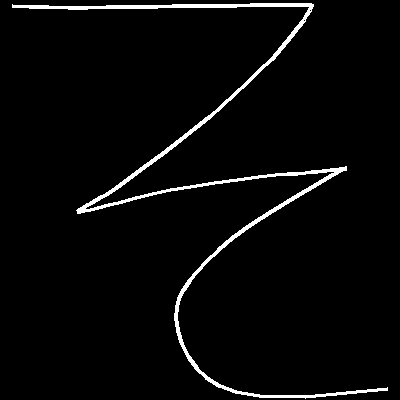

# Recognizing Japanese Text

## Project Goal:
Building an effective open sourced japanese digital writing classification model from the ground up.

## The Use Case:
Learning a new language is hard. Japanese presents an especially significant barrier with having over 2000 glyphs that need to be understood in order to achieve full literacy.
* Immersion is a very effective form of reinforcement and today there are a vast amount of tools that assist in this process.
* Doing drills of writing out the character (and it's radicals) helps the mind distinguish differences in recognizing certain characters that closely resemble one another.

Instead of separating the two the entire time, it could be far more efficient to leverage our digital devices with a high accuracy writing recognizer that leverages deep learning. Writing recognition for Japanese text exists more or less already, however the options available have a trend of being closed source and bloated with ads.

## The Plan:
Leverage what existing datasets are available that could be applied for immediate baseline evaluation/transfer learning. Begin collecting data with a stripped down app, but transition it into a full fledged learning tool that leverages Tensorflow Lite and provides an opt in for users to submit their writing data to build/improve the models.

## The Data:
* Hundreds of thousands of classified classical Japanese glyphs from the [Kuzushiji-49 dataset](https://github.com/rois-codh/kmnist/tree/12d650ef8a97d4e051d7650644912f9500067df6).
* Independent capture of digital writing leveraged from a simple [mobile phone app](https://github.com/coreyryanhanson/choubenkyo_kivy_app).

</img>

## The Notebooks
* [General training with the Kuzushiji Hiragana Dataset](kuzushiji_notebook.ipynb)
* [Building a base for transfer learning](kanji_transfer.ipynb)
* [Applying the models to original data](modeling_with_new_data.ipynb)

## Evaluation criteria:

I chose to evaluate leveraging scikit-learn's balanced accuracy module. That allows each category to have an equal voice in determining the overall accuracy of the model despite the heavy class imbalance.

One caveat about using this metric is that balanced accuracy is meaningless in small batches where the full representation of characters is unknown so simple categorical accuracy was used for backpropogation and the validation splits.

The models were compared against a baseline predictor that made predictions in a random fashion weighted towards the representation of classes in the training set. The result:
* Accuracy: 0.0237
* Balanced Accuracy: 0.0208

## Model Performance
### Models predicting Kuzushiji data
All of the models vastly outperformed the baseline predictor.
* Simple 2 hidden layer dense network:
    * Accuracy: 0.763
    * Balanced Accuracy: 0.763
* Simple 3 hidden layer CNN:
    * Accuracy: 0.917
    * Balanced Accuracy: 0.915
* [VGG16 trained on imageNet](https://www.tensorflow.org/api_docs/python/tf/keras/applications/VGG16) transfer learning model:
    * Accuracy: 0.969
    * Balanced Accuracy: 0.968
* CNN with more convolutional layers:
    * Accuracy: 0.959
    * Balanced Accuracy: 0.958
* Transfer learning on [custom general character dataset](kanji_transfer.ipynb):
    * Accuracy: 0.964
    * Balanced Accuracy: 0.963

### Models predicting original mobile app generated data
With the time constraints the original data collected was a small quantity, but early tests indicate strong performances in both the CNN and LSTM.
* CNN without transfer learning:
    * Accuracy: 0.971
    * Balanced Accuracy: 0.971
* CNN with transfer learning trained on kuzushiji-49:
    * Accuracy: 0.968
    * Balanced Accuracy: 0.971
* CNN with transfer learning trained on [custom general character dataset](kanji_transfer.ipynb):
    * Accuracy: 0.986
    * Balanced Accuracy: 0.988
* LSTM with raw coordinate data:
    * Accuracy: 0.970
    * Balanced Accuracy: 0.964

The LSTM was the weakest performing, however most of the results were close and given the small size of the dataset, one should not count it out. In an environment with more data and more classes, there is a strong possibility that it will outperform the other models since some information is lost in the conversion to bitmap images.

## Next Steps:
With the preliminary findings being complete, it makes sense to drop the kuzushiji dataset entirely and move forward using only the original observations along with the generalized model for transfer learning on the lowest convolutional layers.

The three preliminary notebooks are now archived in a contained section and going forward classification will be done on the entire hiragana set and not limited to the base characters from presence in the kuzushiji dataset.

The data collection app will be rewritten in Java to allow for Tensorflow-lite compatibility and transformed into an actual useful study app that will appeal to learners of Japanese and have a means for users to opt in and submit data across all character sets to develop/improve the models.
